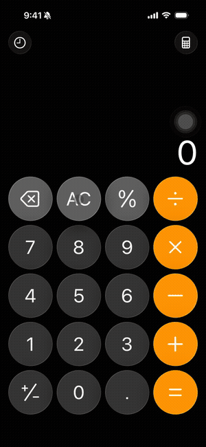

# iPhone Use

Let an AI agent use a real iPhone from your Mac. Nothing is installed on the phone.

<p align="center"></p>

iPhone Use is a small macOS app. It reads the iPhone's screen over a USB cable and
taps and types through Bluetooth, posing as a keyboard and mouse. Your agent gets
an MCP server (and a plain HTTP API) with `screenshot`, `tap`, `swipe`, `type_text`,
`press_key` and `home`.

Because it drives a real, unlocked iPhone the way a person would, apps behave the
way they do in your hand: your accounts, App Store installs, push notifications,
iMessage. No simulator, no developer account, no app on the phone.

## How it works

```
                USB cable: screen frames (CoreMediaIO, like QuickTime)
   ┌──────────┐ ◀──────────────────────────────────────────────── ┌────────┐
   │   Mac    │                                                    │ iPhone │
   │iPhone Use│ ─────────────────────────────────────────────────▶ │        │
   └──────────┘   Bluetooth LE: keyboard + mouse (HID over GATT)   └────────┘
        ▲                                                   AssistiveTouch turns
        │ MCP / HTTP                                        the pointer into taps
     your agent
```

- **Screen.** A trusted iPhone becomes a video capture device once a Mac app sets
  `kCMIOHardwarePropertyAllowScreenCaptureDevices`. iPhone Use keeps the latest frame.
- **Input.** The Mac publishes a Bluetooth LE HID service with `CBPeripheralManager`.
  The iPhone pairs with it like any keyboard. Classic Bluetooth HID is not an option
  on current macOS because `bluetoothd` owns its L2CAP channels.
- **Taps.** With AssistiveTouch on, iOS shows a pointer for mice. iPhone Use's report
  map has an absolute pointer (X and Y from 0 to 32767) that iOS maps straight to the
  screen, so a tap lands exactly where it is aimed, no calibration. iOS ignores the
  absolute pointer's buttons, so the click itself goes through a second, relative
  mouse.
- **Typing.** A standard keyboard report, US layout.

## Requirements

- A Mac with Bluetooth LE (any Apple Silicon Mac). Tested on macOS 26.
- An iPhone and a USB **data** cable. Charge-only cables give power and no screen.
- Xcode command line tools to build.

## Setup

```sh
git clone https://github.com/xhoantran/iphone-use && cd iphone-use
./scripts/build-app.sh            # builds build/iPhoneUse.app
open build/iPhoneUse.app          # allow Bluetooth and Camera when asked
```

Then, once:

1. **Plug the iPhone in**, unlock it and tap **Trust**. On Apple Silicon, if the Mac
   asks "Allow accessory to connect?", click **Allow**. If the screen never shows up,
   check System Settings > Privacy & Security > *Allow accessories to connect*.
2. On the iPhone, **Settings > Bluetooth**: tap **iPhone Use** to pair.
3. On the iPhone, **Settings > Accessibility > Touch > AssistiveTouch**: turn it on.

Check it:

```sh
curl localhost:7390/status
# {"bluetooth":"1 connected, advertising as iPhone Use","devices":[{"id":"...","name":"iPhone",
#   "bluetooth":true,"width":1180,"height":2556}],"unmatchedHosts":[]}
```

iPhone Use runs as a menu-less background app. Quit it with `pkill -x iphone-use`.

## Use it from an agent (MCP)

The same binary is the MCP server. It talks to the running app over localhost.

Claude Code:

```sh
claude mcp add iphone-use -- "$PWD/build/iPhoneUse.app/Contents/MacOS/iphone-use" mcp
```

Any other MCP client:

```json
{
  "mcpServers": {
    "iphone-use": {
      "command": "/path/to/iPhoneUse.app/Contents/MacOS/iphone-use",
      "args": ["mcp"]
    }
  }
}
```

Screenshots are scaled so the long edge is 1200 px. Tap and swipe coordinates are
pixels of that screenshot. Every action returns a fresh screenshot.

| Tool | Arguments |
| --- | --- |
| `list_devices` | |
| `screenshot` | |
| `tap` | `x`, `y` |
| `long_press` | `x`, `y`, `seconds` |
| `swipe` | `x1`, `y1`, `x2`, `y2`, `seconds` |
| `type_text` | `text` (ASCII) |
| `press_key` | `key`, `modifiers` (`cmd`, `shift`, `alt`, `ctrl`) |
| `home` | |

Every tool except `list_devices` also takes `device`, needed only when more than one
iPhone is connected.

`press_key` with `space` + `cmd` opens Spotlight, which is often the fastest way to
open an app: Spotlight, type the name, `enter`.

## HTTP API

Everything listens on `127.0.0.1:7390` (set `IPHONE_USE_PORT` to change it).
Coordinates are pixels of the full-resolution screen unless you pass `width` and
`height` for the image they came from, `maxEdge` for a screenshot taken with that
`maxEdge`, or `"fraction": true` for 0 to 1. With several phones, add `"device"` to the
body (or `?device=` to a GET): the phone's id or name from `/devices`.

```sh
curl localhost:7390/devices
curl localhost:7390/screenshot -o screen.jpg                  # ?format=png, ?maxEdge=1200, ?device=
curl -X POST localhost:7390/tap   -d '{"x":590,"y":1278}'
curl -X POST localhost:7390/swipe -d '{"x1":590,"y1":1900,"x2":590,"y2":700,"duration":0.4}'
curl -X POST localhost:7390/type  -d '{"text":"hello"}'
curl -X POST localhost:7390/key   -d '{"key":"space","modifiers":["cmd"]}'
curl -X POST localhost:7390/home
```

`scripts/record.sh demo.mp4` records the phone screen until you press Ctrl-C.

## Several iPhones

Plug each phone in and pair each one with **iPhone Use** in its Bluetooth settings.
Every phone gets its own screen capture and its own input queue, so phones work in
parallel.

Bluetooth does not say which phone a connection belongs to. So when a new phone
connects, iPhone Use moves the pointer through that connection and looks for the screen
where it moved, then saves the match in
`~/Library/Application Support/iPhoneUse/pairings.json`. Each phone is matched once. If a
match goes wrong:

```sh
curl -X POST localhost:7390/match -d '{"force":true}'            # forget and match again
curl -X POST localhost:7390/pair  -d '{"device":"<id>","host":"<uuid from unmatchedHosts>"}'
```

## Limits

- Several phones at once is new and has only been tested with one phone. Classic
  Bluetooth caps a Mac at 7 devices; iPhone Use runs on Bluetooth LE, whose limit
  depends on the Mac's Bluetooth chip and has not been measured.
- Typing is US ASCII. Other characters need the clipboard (not built yet).
- Portrait only has been tested.
- The phone must stay unlocked. Set Auto-Lock to Never while an agent is working.

## Credits

The idea comes from [TapKit](https://tapkit.ai). The hard parts of being a BLE
keyboard with CoreBluetooth (the long-form `1812` UUID, encrypted attributes, the
Report Reference descriptor) are written up in
[sryo/clak's notes](https://github.com/sryo/clak/blob/main/docs/corebluetooth-hid-notes.md).

## License

MIT
